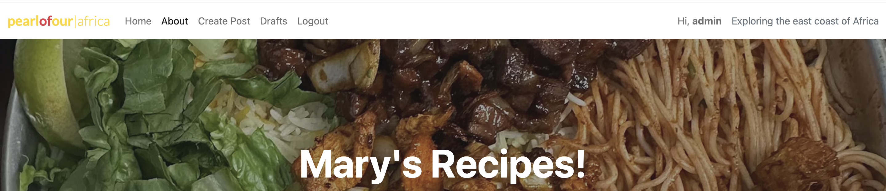

# Mary's Recipes - Share Your Culinary Creations! 🍽️

## Overview
Mary's Recipes Blog is a fully responsive Django web application that allows users to share, review, and comment on their favorite (or least favorite) recipes.  
Users can create their own recipe posts, interact with other users through comments, and explore a collection of dishes from around the world.

## Screenshot of Site  

 

## Deployed Link  
(https://authentic-recipe-457331f032d1.herokuapp.com/about/)  

---

## 📌 Contents  
1. [UX - User Experience](#ux---user-experience)  
   - [User Stories](#user-stories)  
   - [Wireframes](#wireframes)  
   - [Design](#design)  
   - [Accessibility](#accessibility)  
   - [Fonts](#fonts)  
2. [Database Planning](#database-planning)  
3. [Key Features](#key-features)  
4. [Future Features](#future-features)  
5. [AI Implementation](#ai-implementation)  
6. [Testing](#testing)  
7. [Deployment](#deployment)  
   - [Heroku](#heroku)  
   - [PostgreSQL](#postgresql)  
8. [Technologies Used](#technologies-used)  
9. [Credits & Acknowledgements](#credits--acknowledgements)  

---

## 🎯 UX - User Experience  

### **User Stories**
| User Story | Description | Priority |
|------------|------------|----------|
| **Account Registration** | As a site user, I want to register for an account so that I can post and save my recipes. | Must Have |
| **Recipe List** | As a site user, I want to view a list of all available recipes so that I can explore new dishes. | Must Have |
| **Detailed Recipe Page** | As a site user, I want to click on a recipe to view full details, including ingredients and instructions. | Must Have |
| **Create Recipes** | As a site user, I want to submit my own recipes so that I can share them with others. | Must Have |
| **Edit & Delete Recipes** | As a site user, I want to edit and delete my recipes so that I can update or remove them. | Must Have |
| **Post Comments** | As a site user, I want to comment on recipes so that I can interact with the community. | Must Have |
| **Moderate Comments** | As a site admin, I want to approve or delete comments so that I can maintain a positive environment. | Must Have |
| **Pagination** | As a user, I want the recipe list to be paginated so that I can browse easily. | Should Have |
| **Recipe Categories** | As a user, I want recipes to be categorized (e.g., desserts, main courses) so that I can find specific types of dishes. | Should Have |
| **Like & Favorite Recipes** | As a user, I want to save my favorite recipes so that I can easily find them later. | Could Have |

### **Wireframes**
- **Mobile Wireframes**: 
- **Tablet Wireframes**:  
- **Desktop Wireframes**:

### **Design**
#### **Color Scheme**
- `#1a3c40` – Deep Green  
- `#f4eae0` – Soft Beige  
- `#c08457` – Warm Brown  
- `#e1b382` – Light Brown  
- `#a15c38` – Rustic Orange  


Coolors was used to help finalize the color palette. I wanted to go for a walm color that represented the spices that are often used in Somali food, but I wasn't able to achieve the rich colors i wanted due to time restraint. In the future i would spend more time on the color palette and css of the website to achieve a warm and cosy look that represents the culture of the food.

### **Accessibility**
- ✅ Semantic HTML: Proper heading structures and meaningful elements.  
- ✅ Color Contrast: Checked for readability.  
- ✅ Responsive Design: Works across all screen sizes.  

### **Fonts**
- **Playfair Display**: For headers, giving an elegant and refined touch.  
- **Lato**: A clean and readable sans-serif for body text.  

---

## 🗄️ Database Planning  

### **Models**
- **User** – Stores user information.  
- **Recipe** – Contains details about each recipe (title, description, ingredients, instructions, image, etc.).  
- **Comment** – Stores user comments on recipes.  

---

## 🔑 Key Features  

### **General**
- **Navbar**: Navigation links to Home, About, Create Recipe, Login/Logout.  


- **Footer**: Displays copyright and the school name.  


### **Recipes**
- **CRUD Functionality**: Users can create, read, edit, and delete their own recipes.  
- **Image Uploads**: Recipes include an image upload feature.  
- **Search & Filters**: Users can search for recipes or filter by categories.  
- **Recipe Details Page**: Displays recipe title, ingredients, instructions, and comments.  

### **Comments**
- **CRUD Functionality**: Users can post, edit, and delete comments.  
- **Moderation**: Admins can approve or delete inappropriate comments.  

---

## 🚀 Future Features  
- **User Profiles**: Users will have profiles showing their submitted recipes and interactions.  
- **Recipe Ratings**: A 5-star rating system for recipes.  
- **Shopping List Generator**: Users can generate a shopping list from recipe ingredients.  
- **AI-Powered Recommendations**: Suggest similar recipes based on user preferences.  

---

## 🤖 AI Implementation  
AI tools like GitHub Copilot were used for:  
- Assisting in writing Django models and views.  
- Troubleshooting form validation issues.  
- Helping structure JavaScript functions for interactivity.  

**Challenges faced with Copilot:**  
- Occasionally generated incorrect function names.  
- Required manual debugging for Django template errors.  

---

## 🧪 Testing  
See `TEST.md` for details on manual testing, validators, and Lighthouse results.  

---

## 🌍 Deployment  

### **Heroku Deployment**
1. **Install dependencies**:
   ```sh
   pip install gunicorn django-heroku
   ## Deployment

**Mary's Recipe Blog** has been deployed using [Heroku](https://www.heroku.com/), a cloud platform for building, running, and scaling applications. Below is a detailed guide on how the deployment was set up.

### Prerequisites
Before deploying to Heroku, make sure you have the following installed:
- **Git**: Version control tool to push your code to Heroku.
- **Heroku CLI**: Command line interface tool to interact with Heroku.
- **Python** and **pip**: Python environment to run your Django app.
- **PostgreSQL**: Heroku provides a free PostgreSQL add-on for production databases.

### Deployment Steps

1. **Set up Heroku account**:
   - If you haven't already, create a Heroku account at [Heroku](https://signup.heroku.com/).
   - Install the [Heroku CLI](https://devcenter.heroku.com/articles/heroku-cli).

2. **Create a Heroku app**:
   - Log in to Heroku via the CLI:
     ```bash
     heroku login
     ```
   - In your project directory, create a Heroku app:
     ```bash
     heroku create marysrecipe
     ```
   - This will create a new Heroku app, providing a URL where your app will be live.

3. **Prepare the project for deployment**:
   - Ensure the following files are in your project directory:
     - **Procfile**: Specifies how Heroku should run the app.
       ```bash
       web: gunicorn marysrecipe.wsgi
       ```
     - **requirements.txt**: List of dependencies for the Django app.
       ```bash
       pip freeze > requirements.txt
       ```
     - **runtime.txt**: Specifies the Python version to use.
       ```bash
       python-3.8.10
       ```
     - **PostgreSQL database**: You can add the Heroku PostgreSQL database addon.
       ```bash
       heroku addons:create heroku-postgresql:hobby-dev
       ```

4. **Handle static files**:
   - To manage static files in production, install the `whitenoise` package:
     ```bash
     pip install whitenoise
     ```
   - Update `settings.py` to use Whitenoise for static files:
     ```python
     MIDDLEWARE = [
         'whitenoise.middleware.WhiteNoiseMiddleware',
         ...
     ]
     STATIC_URL = '/static/'
     STATIC_ROOT = os.path.join(BASE_DIR, 'staticfiles')
     ```
   - Collect static files by running:
     ```bash
     python manage.py collectstatic
     ```

5. **Commit and push changes to Git**:
   - Add and commit all changes:
     ```bash
     git add .
     git commit -m "Prepare for Heroku deployment"
     ```
   - Push to Heroku:
     ```bash
     git push heroku master
     ```

6. **Set environment variables**:
   - Set necessary environment variables such as `SECRET_KEY` and `DEBUG`:
     ```bash
     heroku config:set SECRET_KEY=your_secret_key
     heroku config:set DEBUG=False
     ```
   - Run migrations to set up the database:
     ```bash
     heroku run python manage.py migrate
     ```

7. **Open the app**:
   - Once the app is deployed, you can access it by running:
     ```bash
     heroku open
     ```

8. **Monitor the app**:
   - To view logs for the app, use:
     ```bash
     heroku logs --tail
     ```

### Troubleshooting
- If you encounter issues, check the Heroku logs for detailed error messages:
  ```bash
  heroku logs --tail
