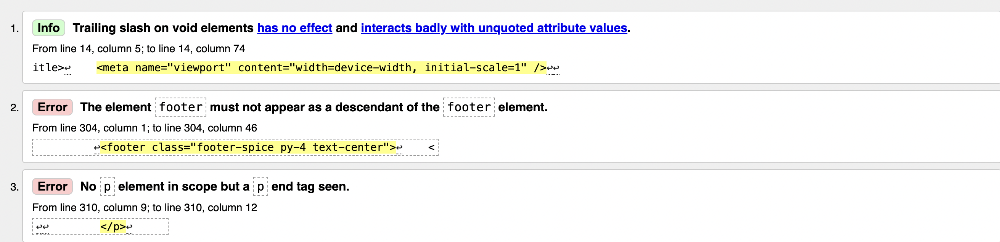
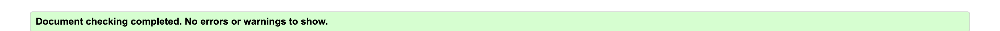
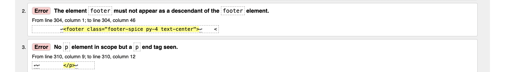
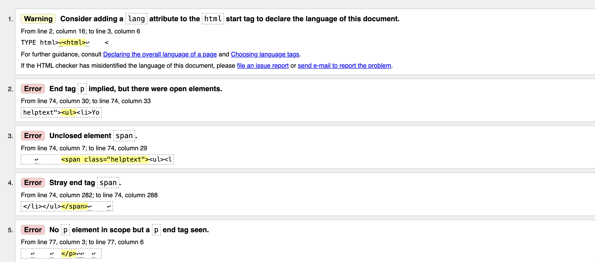

# Manual Testing

## Feature Overview
| Feature                          | Description                                                                                      | Status |
|----------------------------------|--------------------------------------------------------------------------------------------------|--------|
| Navigational links in Navbar     | Ensure all navigational links in the navbar are working correctly.                                | Pass   |
| Links on all pages               | Verify that all links on various pages are functional and redirect correctly.                    | Pass   |
| Form input on create_recipe page | Test the form input fields on the create recipe page to ensure they accept and process data correctly. | Pass   |
| Responsiveness on all screen sizes | Check the responsiveness of the site on different screen sizes to ensure proper display and functionality. | Pass   |
| User registration and login      | Test the user registration process to ensure users can create accounts and log in correctly.      | Pass   |
| Recipe creation functionality    | Verify that users can successfully create and post recipes.                                       | Pass   |
| Commenting on recipes            | Ensure that logged-in users can comment on admin's recipes.                                        | Pass   |
| Recipe editing functionality     | Ensure users can edit their own recipes.                                                        | Pass   |
| Recipe deletion functionality    | Ensure users can delete their own recipes.                                                      | Pass   |

## Browsers Tested
This project has been tested on:
- Brave
- Safari
- Firefox
- Chrome

## Devices Tested
This project has been tested on:
- Samsung
- Macbook 
- Windows xp
- Iphone 16 pro max

# Unit Testing

## Views

| Test Case                          | Description                                                                                                     | Status |
|-----------------------------------|-----------------------------------------------------------------------------------------------------------------|--------|
| test_recipe_detail_view           | Tests the recipe_detail view to ensure it returns the correct status code, template, and contains the expected content. | Pass   |
| test_recipe_list_view             | Tests the recipe_list view to ensure it returns the correct status code, template, and contains the expected content.   | Pass   |
| test_user_recipe_list_view        | Tests the user_recipe_list view to ensure it returns the correct status code, template, and contains the expected content for the logged-in user. | Pass   |
| test_create_recipe_view           | Tests the create_recipe view to ensure it returns the correct status code, template, and contains the expected forms. | Pass   |
| test_edit_recipe_view             | Tests the edit_recipe view to ensure it returns the correct status code, template, and contains the expected form. | Pass   |
| test_delete_recipe_view           | Tests the delete_recipe view to ensure it returns the correct status code and template.                           | Pass   |
| test_comment_on_recipe_view       | Tests the comment functionality on a recipe to ensure comments can be posted and displayed correctly.             | Pass   |

## Forms

| Test Case                                           | Description                                                                                         | Status |
|----------------------------------------------------|-----------------------------------------------------------------------------------------------------|--------|
| TestCommentForm.test_form_is_valid                 | Tests the CommentForm to ensure it is valid when provided with a valid body.                        | Pass   |
| TestCommentForm.test_form_is_invalid               | Tests the CommentForm to ensure it is invalid when the body is empty.                               | Pass   |
| TestRecipeForm.test_form_is_valid                  | Tests the RecipeForm to ensure it is valid when provided with a valid title, ingredients, and instructions. | Pass   |
| TestRecipeForm.test_form_is_invalid_empty_title    | Tests the RecipeForm to ensure it is invalid when the title is empty.                                | Pass   |
| TestRecipeForm.test_form_is_invalid_empty_ingredients | Tests the RecipeForm to ensure it is invalid when the ingredients field is empty.                  | Pass   |
| TestRecipeForm.test_form_is_invalid_empty_instructions | Tests the RecipeForm to ensure it is invalid when the instructions field is empty.                | Pass   |

# Validators

## W3C
Trailing Slash on Void Elements
The error about the trailing slash on void elements refers to self-closing tags, like <meta />. While adding a trailing slash is technically allowed in XHTML and some HTML conventions, in HTML5 it doesn't impact functionality. However, it can cause issues when combined with unquoted attribute values or other HTML errors. Due to time constraints, I wasn't able to fully address this issue.

<footer> Element Inside Another <footer>
The error about placing a <footer> inside another <footer> arises from improper HTML structure. The <footer> element is not intended to be nested within itself. This was an oversight, and I didn't have time to restructure the elements correctly before submission.

Unmatched Closing 
 Tag
The "No 
 element in scope but a 
 end tag seen" error indicates that there is a closing 
 tag without a corresponding opening 
 tag within the correct scope. This is a common issue when HTML is not properly nested or when a tag is mistakenly closed early. This error was caused by time constraints in the final stages of development.

Conclusion
While these errors have been noted, they don’t significantly impact the functionality of the project. Due to time limitations, I wasn't able to address these issues fully before submission but plan to fix them in future updates.

## HTML Validation
| Page                | Status  |
|---------------------|---------|
| Index               | index   |
| Recipe List         | RL      |
| User Recipe List    | URL     |
| Recipe Detail       | RD      |
| Create Recipe       | CR      |
| Edit Recipe         | ER      |
| Delete Recipe       | DR      |

About: 

Create Post:

Create Drafts:

Logout:

Signup:

Login:

## Jigsaw CSS Validator
Used Jigsaw CSS validator with no errors.

## CSS Validation
| File         | Status   |
|--------------|----------|
| style.css    | css_valid|

## Code Institute's Python Linter

## Python Files
| File                   | Status   |
|------------------------|----------|
| settings.py            | settings.py |
| urls.py                | urls.py     |
| recipes/views.py       | views.py    |
| recipes/urls.py        | recipes/urls.py |
| recipes/models.py      | models.py   |
| recipes/admin.py       | admin.py    |
| recipes/forms.py       | forms.py    |
| recipes/test_forms.py  | test_forms.py |
| recipes/test_views.py  | test_views.py |

# Lighthouse

## Performance Scores

| Page                | Mobile     | Desktop    |
|---------------------|------------|------------|
| Index               | indexmobile| indexdesktop|
| Recipe List         | recipe_listmobile | recipe_listdesktop |
| User Recipe List    | user_recipe_list | user_recipe_listdesktop |
| Recipe Detail       | recipe_detail | recipe_detaildesktop |
| Create Recipe       | create_recipe | create_recipedesktop |
| Edit Recipe         | edit_recipe | edit_recipedesktop |
| Delete Recipe       | delete_recipe | delete_recipedesktop |
